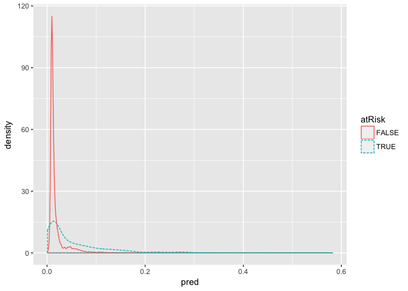
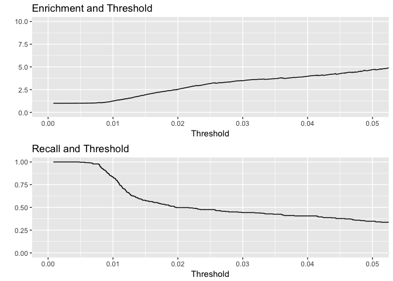

Logistic Regression
================

Overview
--------

Logistic regression is the most important member of a class of models called *generalized linear models*. Logistic regresion can directly predict values that are restricted to the (0, 1) interval, such as probabilities.

Logistic regression predicts the probability `y` that an instance belongs to a specific category. When `x[i, ]` is a row of inputs, logistic regression finds a fit function `f(x)` such that:

`P[y[i] in class] ~ f(x[i, ]) = s(a+b[1] x[i, 1] + ... b[n] x[i, n])`

Here, `s(z)` is the *sigmoid function*, which is defined as `s(z) = 1/(1+exp(z))`. If the y\[i\] are the probabilities that the `x[i,]` belong to the class of interest, then the task of fitting is to find the `b[1], ..., b[n]` such that `f(x[i,])` is the best possible estimate of `y[i]`.

The sigmoid function maps real numbers to the interval (0, 1) -- to probabilities. The inverse of the sigmoid is the *logit*, which is defined as `log(p / (1 - p))`, where `p` is a probability.

The ratio `p / (1 - p)` is known as the `odds` -- the logit is the log of the odds, or log-odds. In other words, you can think of logistic regression as a linear regression that finds the log-odds of the probability you're interested in. It assumes that `logit(y)` is linear in the values of x.

CDC Example
-----------

We'll use Win Vector's example of at-risk babies. We'll use the [**sample dataset**](https://github.com/WinVector/zmPDSwR/tree/master/CDC) from the CDC 2010 natality public-use data file.

This dataset includes statistics for all births registered in the 50 US states and includes facts about the mother and father, and the delivery.

``` r
# Load dataset
load("~/Downloads/NatalRiskData.rData")
```

Cool, 26 thousand births in the dataset. Let's split the data into training and testing sets.

``` r
# Split data into training and testing sets
train <- sdata[sdata$ORIGRANDGROUP <= 5, ]
test <- sdata[sdata$ORIGRANDGROUP > 5, ]
```

Great! Here are the columns in the dataset we'll use:

-   `atRisk`: `TRUE` if 5-minute Apgar score is less than 7, `FALSE` otherwise
-   `PWGT`: Mother's pregnancy weight
-   `UPREVIS`: Number of prenatal medical visits
-   `CIG_REC`: `TRUE` if smoker, `FALSE` otherwise
-   `GESTREC3`: Two categories: `<37 weeks` (premature) and `>= 37 weeks`
-   `DPLURAL`: Birth plurality, `single`, `twin`, or `triplet+`
-   `ULD_MECO`: `TRUE` if moderate/heavy fecal staining
-   `ULD_PRECIP`: `TRUE` for unusually short labor
-   `ULD_BREECH`: `TRUE` for breech birth position
-   `URF_DIAB`: `TRUE` if mother is diabetic
-   `URF_CHYPER`: `TRUE` if mother has hypertension
-   `URF_PHYPER`: `TRUE` if mother has pregnancy-related hypertension
-   `URM_ECLAM`: `TRUE` if mother experienced eclampsia

Ok, phew. Now we're ready to build the model.

Building the model
------------------

The command to build a logistic regression model in R is `glm()`. The dependent variable is `atRisk` and the other variables are independent.

``` r
# Define the complications and risk factors
complications <- c("ULD_MECO", "ULD_PRECIP", "ULD_BREECH") 
riskfactors <- c("URF_DIAB", "URF_CHYPER", "URF_PHYPER", "URF_ECLAM")

# Set dependent and independent variables
y <- "atRisk"
x <- c("PWGT", "UPREVIS", "CIG_REC", "GESTREC3", "DPLURAL", complications, riskfactors)

# Define the model's formula
fmla <- paste(y, paste(x, collapse = ' + '), sep = "~")
fmla
```

    ## [1] "atRisk~PWGT + UPREVIS + CIG_REC + GESTREC3 + DPLURAL + ULD_MECO + ULD_PRECIP + ULD_BREECH + URF_DIAB + URF_CHYPER + URF_PHYPER + URF_ECLAM"

Now let's build the model on the training dataset.

``` r
# Train model
model <- glm(fmla, data = train, family = binomial(link = "logit"))
```

There is an extra agrument in this call, `family = binomial(link = "logit"))`. The `family` function specifies the assumed distribution of the dependent variable `y`. In our case, we're modeling `y` as a *binomial distribution*, or as a coin whose probability of heads depends on `x`.

The `link` function "links" the output to a linear model -- pass `y` through the `link` function, and then modle the resulting value as a linear function of the `x` values.

Different combinations of `family` functions and `link` functions lead to different kinds of generalized linear models (Poisson, probit, etc.) Without an explicit `family` argument, `glm` will default to standard linear regression.

### Making predictions

Let's make some predictions for both the training and testing sets.

``` r
# Make predictions
train$pred <- predict(model, newdata = train, type = "response")
test$pred <- predict(model, newdata = test, type = "response")
```

The parameter `type = "response"` tells the `predict()` function to return the predicted probabilities of `y`. If you don't specify that, then by default will return the output of the `link` function, `logit(y)`, and you have to do an extra transformation.

One strength of logistic regression is that it preserves the marginal probabilities of the training data. That means that if you sum up the predicted probability scores for the entire training set, that quantity will be equal to the number of positive outcomes (atRisk == T) in the training set. This is also true for subsets of the data determined by variables included in the model.

### Characterizing prediction quality

Our goal is to use the model to classify new instances into one of two categories. We want the model to give high scores to positive instances and low scores otherwise.

Let's plot the double-density plot of the predictions.

``` r
library(ggplot2)
```

    ## Warning: package 'ggplot2' was built under R version 3.2.5

``` r
# Plot double density plot
ggplot(train, aes(x = pred, color = atRisk, linetype = atRisk)) +
  geom_density()
```



Ideally, we'd like the distribution of scores to be separated, with the scores of the negative instances to be concentrated on the left, and the distribution for the positive instances to be concentrated on the right. In this case, both distributions are concentrated on the left. This isn't surprising, sinse positive instances are rare (about 1.8%).

In order to use the model as a classifier, you must pick a threshold, above which scores will be classified as positive and below as negative.

When you pick a threshold, you're trying to balance the *precision* of the classifier (what fraction of the predicted positives are true positives) and its *recall* (how many of the true positives the classifier finds).

If the score distributions of the positive and negative instances are well separated, then we can pick an appropriate threshold in the "valley" between the two peaks. In the current case, the score distributions aren't well separated, which indicates that the model can't build a classifier that simultaneously achieves good recall and good precision.

But we can build a classifier that identifies a subset of situations with a higher-than-average rate of at-risk births. We'll call the ratio of the classifier precision to the average rate of positives the *enrichment rate*.

The higher we set the threshold, the more *precise* the classifier will be; but we'll also miss a higher percentage of at-risk situations.

We'll use the training set to pick a threshold and use the training set to evaluate its performance.

To help pick a threshold, we can use a plot that shows both enrichment and recall as a function of the threshold.

``` r
library(ROCR); library(gridExtra)

# Create a prediction object
predObj <- prediction(train$pred, train$atRisk)

# Create an ROCR object to calculate precision as a function of threshold
precObj <- performance(predObj, measure = "prec")

# Create an ROCR object to calculate recall as a function of threshold
recObj <- performance(predObj, measure = "rec")

# Extract precision and recall from S4 objects with @ notation
precision <- (precObj@y.values)[[1]]
recall <- (recObj@y.values)[[1]]

# The x values (thresholds) are the same in both predObj and recObj
prec.x <- (precObj@x.values)[[1]]
```

Phew, now let's build a data frame with thresholds, precision, and recall.

``` r
# Build data frame
rocFrame <- data.frame(threshold = prec.x, precision = precision, recall = recall)
```

Now we can build a couple plots.

``` r
# Calculate rate of at-risk births in the training set
pnull <- mean(as.numeric(train$atRisk))

p1 <- ggplot(rocFrame, aes(x = threshold)) +
  geom_line(aes(y = precision / pnull)) +
  coord_cartesian(xlim = c(0, 0.05), ylim = c(0, 10)) +
  labs(x = "Threshold", y = "", title = "Enrichment and Threshold")

p2 <- ggplot(rocFrame, aes(x = threshold)) +
  geom_line(aes(y = recall)) +
  coord_cartesian(xlim = c(0, 0.05)) +
  labs(x = "Threshold", y = "", title = "Recall and Threshold")

grid.arrange(p1, p2, ncol = 1)
```

    ## Warning: Removed 1 rows containing missing values (geom_path).



Looking at the plots, you can see that higher thresholds result in more precise classifications, at the cost of missing more cases; a lower threhold will identify more cases, at the cost of many more false positives. The best tradeoff between precision and recall is a function of how many resources the hospital has to allocate, and how many they keep in reserve.

a threshold of 0.02 (which incidentally is about the overall rate of at-risk births in the trainin data) might be a good tradeoff. The resulting classifier will identify a set of potential at-risk situations that finds about half of all the true at-risk situations, with a true positive rate 2.5 times higher than the overall population.

Let's evaluate 0.02 as a threshold.

``` r
# Build confusion matrix
confuse <- table(pred = test$pred > 0.02, atRisk = test$atRisk)
confuse
```

    ##        atRisk
    ## pred    FALSE TRUE
    ##   FALSE  9487   93
    ##   TRUE   2405  116

The rows contain predicted negatives and positives, and the columns contain actual negatives and positives. Let's calculate precision and recall.

``` r
# Calculate precision
precision <- confuse[2, 2] / sum(confuse[2, ])
precision
```

    ## [1] 0.04601349

``` r
# Calculate recall
recall <- confuse[2, 2] / sum(confuse[, 2])
recall
```

    ## [1] 0.5550239

``` r
# Calculate enrichment
enrich <- precision / mean(as.numeric(test$atRisk))
enrich
```

    ## [1] 2.664159

The resulting classifier is low-precision, but identifies a set of potential at-risk cases that contain 55.5% of the true positive cases in the test set, at a rate 2.66 times higher than the overall average.

### Finding relationships

Logistic regression is similar to linear regression in that you can use the coefficients to determine relationships.

``` r
# List the coefficients in the model.
coefficients(model)
```

    ##              (Intercept)                     PWGT                  UPREVIS 
    ##              -4.41218940               0.00376166              -0.06328943 
    ##              CIG_RECTRUE       GESTREC3< 37 weeks DPLURALtriplet or higher 
    ##               0.31316930               1.54518311               1.39419294 
    ##              DPLURALtwin             ULD_MECOTRUE           ULD_PRECIPTRUE 
    ##               0.31231871               0.81842627               0.19172008 
    ##           ULD_BREECHTRUE             URF_DIABTRUE           URF_CHYPERTRUE 
    ##               0.74923672              -0.34646672               0.56002503 
    ##           URF_PHYPERTRUE            URF_ECLAMTRUE 
    ##               0.16159872               0.49806435

As with linear regression, categorical variables are expanded to a set of indicator variables. **Logistic regression dislikes a large variable count** and as with linear regression, you should avoid categorical variables with too many levels.

### Interpreting the coefficients

It is a little more complicated to interpret the coefficients. If the coefficient of `x[, k]` is `b[k]`, then the odds of a positive outcome are multiplied by a factor of `exp(b[k])` for every unit change in `x[, k]`.

In our model the coefficient for `GESTREC3 < 37 weeks` is 1.54518311. So for a premature baby, the odds of being at risk are `exp(1.545183) = 4.689` times higher compared compared to a baby that's born full-term, with all other input variables unchanged.

As an example, suppose a full term baby has a 1% probability of being at risk. The odds are `p / (1-p)` = 0.0101. Then the odds for a premature baby with the same characteristics are 0.0101 \*4.68883 = 0.047. This corresponds to a probability of being at risk of `odds / (1 + odds)`, or `0.047 / 1.047 = 4.5%`.

### Reading model summary

We want to make sure the model is actually explaining something. The diagnostics in the model summary will help us determine facts about the model quality.

``` r
# Summarize the model
summary(model)
```

    ## 
    ## Call:
    ## glm(formula = fmla, family = binomial(link = "logit"), data = train)
    ## 
    ## Deviance Residuals: 
    ##     Min       1Q   Median       3Q      Max  
    ## -0.9732  -0.1818  -0.1511  -0.1358   3.2641  
    ## 
    ## Coefficients:
    ##                           Estimate Std. Error z value Pr(>|z|)    
    ## (Intercept)              -4.412189   0.289352 -15.249  < 2e-16 ***
    ## PWGT                      0.003762   0.001487   2.530 0.011417 *  
    ## UPREVIS                  -0.063289   0.015252  -4.150 3.33e-05 ***
    ## CIG_RECTRUE               0.313169   0.187230   1.673 0.094398 .  
    ## GESTREC3< 37 weeks        1.545183   0.140795  10.975  < 2e-16 ***
    ## DPLURALtriplet or higher  1.394193   0.498866   2.795 0.005194 ** 
    ## DPLURALtwin               0.312319   0.241088   1.295 0.195163    
    ## ULD_MECOTRUE              0.818426   0.235798   3.471 0.000519 ***
    ## ULD_PRECIPTRUE            0.191720   0.357680   0.536 0.591951    
    ## ULD_BREECHTRUE            0.749237   0.178129   4.206 2.60e-05 ***
    ## URF_DIABTRUE             -0.346467   0.287514  -1.205 0.228187    
    ## URF_CHYPERTRUE            0.560025   0.389678   1.437 0.150676    
    ## URF_PHYPERTRUE            0.161599   0.250003   0.646 0.518029    
    ## URF_ECLAMTRUE             0.498064   0.776948   0.641 0.521489    
    ## ---
    ## Signif. codes:  0 '***' 0.001 '**' 0.01 '*' 0.05 '.' 0.1 ' ' 1
    ## 
    ## (Dispersion parameter for binomial family taken to be 1)
    ## 
    ##     Null deviance: 2698.7  on 14211  degrees of freedom
    ## Residual deviance: 2463.0  on 14198  degrees of freedom
    ## AIC: 2491
    ## 
    ## Number of Fisher Scoring iterations: 7

The deviance residuals are the analog to the residuals to the linear regression model. In linear regression, the residuals are the vector of the differences between the true outcome values and the predicted output values (the errors). In logistic regression, the deviance residuals are related to the *log likelihoods* of having observed the true outcome, given the predicted probability of that outcome.

The idea behind log likelihood is that positive instances `y` should have a high probability `p(y)` of occurring under the model; negative instances should have a low probability, or a large value of `(1-p(y))`.

The log likelihood function rewards "matches" between the outcome `y` and the probability `p(y)`, and penalizes mismatches.

Logistic regression models are found by minimizing the sum of the squared residual deviances, or maximizing the log likelihood of the data.

**Overall model quality summaries** Deviance is again a measure of how well the model fits the data. It is 2 times the negative log likelihood of the dataset, given the model. The *null deviance* is similar to the variance of the data around the average rate of positive examples. The *residual deviance* is similar to the variance of the data around the model.

We can calculate these deviances for both the training and testing sets

``` r
# Function to calculate the log likelihood of a dataset
loglikelihood <- function(y, py) {
  
  sum(y * log(py) + (1 - y) * (log(1 - py)))
  
}

# Calculate rate of positive examples in dataset
pnull <- mean(as.numeric(train$atRisk))

# Calculate null deviance
null_dev <- -2 * loglikelihood(as.numeric(train$atRisk), pnull)

# Calculate the deviance of model for training data
pred <- predict(model, newdata = train, type = "response")
resid_dev <- -2 * loglikelihood(as.numeric(train$atRisk), pred)
```

Let's do this for the testing set.

``` r
testy <- as.numeric(test$atRisk)

# Calculate null deviance and residual deviance for test data
testpred <- predict(model, newdata = test, type = "response")

# Calculate rate of positive examples in testing set
pnull_test <- mean(testy)

# Calculate null deviance
null_dev_dest <- -2 * loglikelihood(testy, pnull_test)

# Calculate residual deviance
resid_dev_test <- -2 * loglikelihood(testy, testpred)

# Print the metrics
pnull_test
```

    ## [1] 0.0172713

``` r
null_dev_dest
```

    ## [1] 2110.91

``` r
resid_dev_test
```

    ## [1] 1947.094

The first thing we can do with the null and residual deviances is check whether the model's probability predictions are better than just guessing the averate rate of positives.

In other words, is the reduction in deviance from the model meaningful, or something that was observed by chance. This is similar to calculating the F-test statistics in linear regression. In the case of logistic regression, the test we need is the *chi-squared test*.

To do that, we need the degrees of freedom for the null model and actual model (which are in the summary).

If hte number of data points in the training set is large, and `df_null - df_model` is small, then the probability of the difference in deveiances as large as we observed is approximately distributed as a chi-squared distribution with `df_null - df_model` degrees of freedom.

Let's calculate the significance of the observed fit.

``` r
# Calculate degrees of freedom
df_null <- dim(train)[[1]] - 1
df_model <- dim(train)[[1]] - length(model$coefficients)

# Compute difference in deviances
deviance_diff <- null_dev - resid_dev

# Compute difference in degrees of freedom
df_diff <- df_null - df_model

# Estimate probability of seeing the observed difference in deviances
p <- pchisq(deviance_diff, df_diff, lower.tail = F)
p
```

    ## [1] 5.84896e-43

Wahoo! the p-value is very small, meaning it's extremely unlikely that we wouldn't seen this much reduction in deviance by chance.

**The pseudo R-squared** A useful goodness of fit measure based on the deviances is pseudo R-squared: `1 - (dev_model / dev_null)`. The pseudo R-squared is the analog to the R-squared measure for linear regression. It’s a measure of how much of the deviance is “explained” by the model. Ideally, you want the pseudo R-squared to be close to 1. Let’s calculate the pseudo-R-squared for both the test and training data.

``` r
# Calculate pseudo R-squared on training data
pr2 <- 1 - (resid_dev / null_dev)

# Calculate pseudo R-squared on testing data
pr2.test <- 1 - (resid_dev_test / null_dev_dest)

pr2.test
```

    ## [1] 0.07760427

The model only explains about 7.7% of deviance, so it's not a highly predictive model. This tells us that we haven't yet identified all the factors that do actually predict at-risk births.

**The AIC** The *Akaike information criterion* is the log likelihood adjusted for the number of coefficients. Let's calculate it.

``` r
# Calculate AIC
aic <- 2 * length(model$coefficients) - loglikelihood(as.numeric(train$atRisk), pred)
aic
```

    ## [1] 1259.496

The AIC is usually used to decide which and how many input variables to use in the model. If you train many different models with different sets of variables on the same training set, you can consider the model with the lowest AIC to be the best fit.

**Fisher scoring iterations** The Fisher scoring method is an iterative optimization method similar to Newton’s method that `glm()` uses to find the best coefficients for the logistic regression model. You should expect it to converge in about six to eight iterations. If there are more iter- ations than that, then the algorithm may not have converged, and the model may not be valid.

**Separation and quasi-separation** The probable reason for nonconvergence is separation or quasi-separation: one of the model variables or some combination of the model variables predicts the outcome perfectly for at least a subset of the training data. You’d think this would be a good thing, but ironically logistic regression fails when the variables are too powerful. Ide- ally, glm() will issue a warning when it detects separation or quasi-separation:

`Warning message: glm.fit: fitted probabilities numerically 0 or 1 occurred`

Unfortunately, there are situations when it seems that no warning is issued, but there are other warning signs:

-   An unusually high number of Fisher iterations
-   Very large coefficients, usually with extremely large standard errors
-   Residual deviances larger than the null deviances

If you see any of these, the model is suspect.
